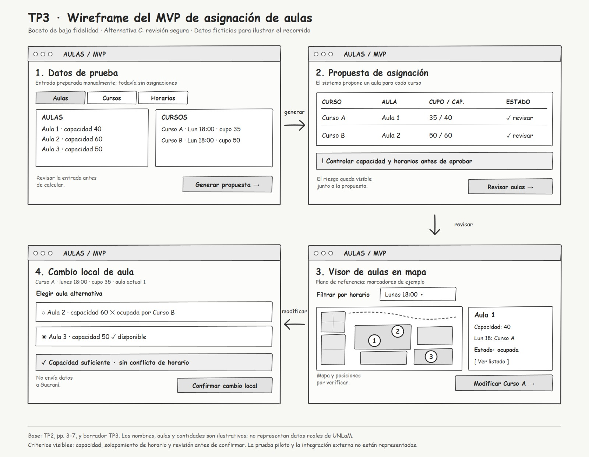

# Diseño del MVP

## Tres alternativas de diseño propuestas

| Alternativa             | Estructura de pantalla                                                                                                | Atributo privilegiado    |
| ----------------------- | --------------------------------------------------------------------------------------------------------------------- | ------------------------ |
| **A — Guiada**          | Datos → generación → revisión por curso → confirmación → monitoreo. Cada pantalla indica claramente qué acción corresponde realizar y mantiene visible el contexto del proceso.       | Recuerdo en el tiempo |
| **B — Tablero**         | Una vista reúne datos, propuesta, filtros y acciones rápidas; un panel secundario abre la edición.                    | Eficiencia               |
| **C — Revisión segura** | Datos → propuesta con alertas → monitoreo filtrable → cambio con control de capacidad y horario → resultado revisado. | Tasa de errores          |

## Elección y fundamentación

| Alternativa             | Qué gana                                            | Qué resigna                                           | Dato de TP2                                                              |
| ----------------------- | --------------------------------------------------- | ----------------------------------------------------- | ------------------------------------------------------------------------ |
| **A — Guiada**          | Permite retomar el proceso después de períodos largos sin uso mediante pasos explícitos y contexto visible.                         | Requiere más navegación y más pasos para completar una tarea.               | El proceso de asignación se realiza una vez por cuatrimestre, por lo que el usuario puede pasar varios meses sin utilizar el sistema. |
| **B — Tablero**         | Menos pasos de consulta.                            | Mayor densidad; conflictos pueden pasar inadvertidos. | Se reportan errores humanos, superpoblación y solapamientos (pp. 3–4).   |
| **C — Revisión segura** | Hace visibles los riesgos antes de aprobar cambios. | Agrega una revisión y reduce velocidad.               | TP2 exige ausencia de solapamientos y excedentes de capacidad (pp. 6–7). |

### Propuesta final

Se elige la **Alternativa C — Revisión segura** para el wireframe porque la corrección de la asignación es condición explícita de la hipótesis. La revisión de capacidad y horario antes de confirmar aborda lo descrito en TP2.

Su costo es un paso adicional; la conveniencia de ese paso tendrá que comprobarse con el personal administrativo durante la evaluación.

